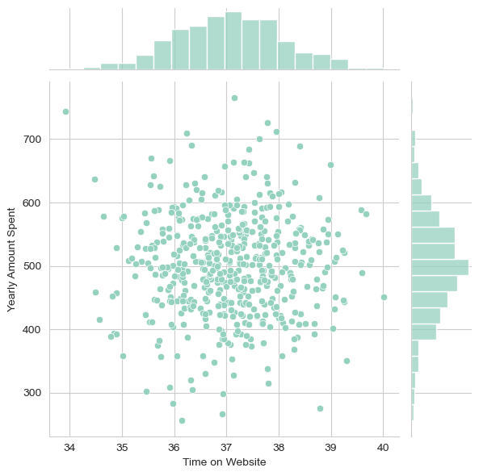
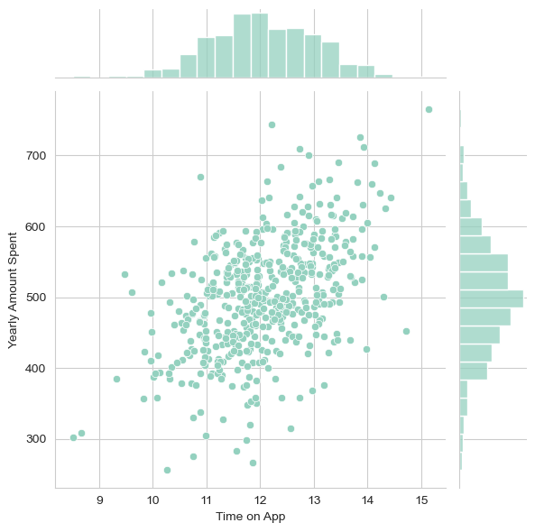
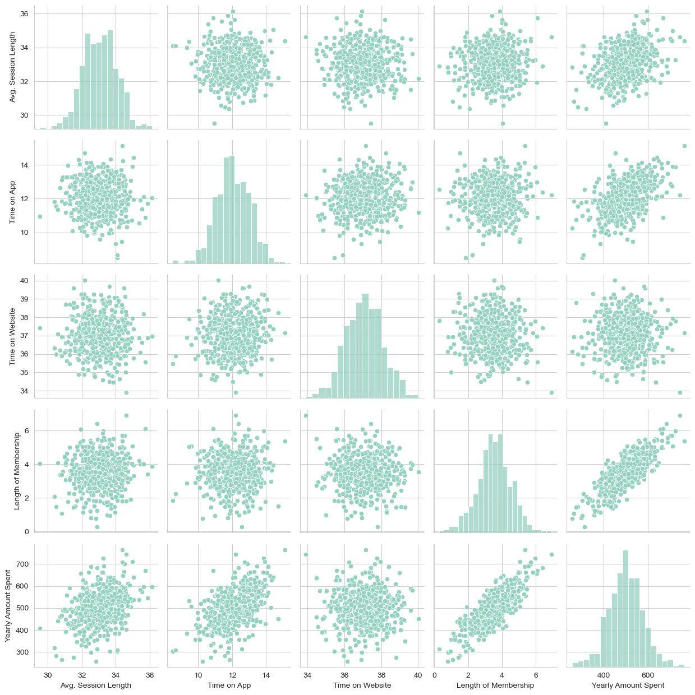
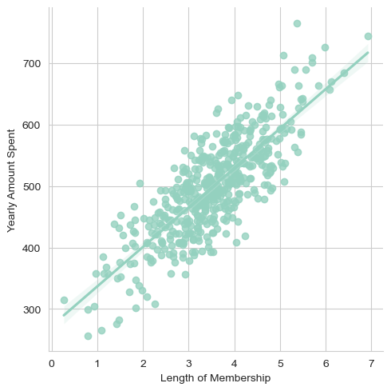
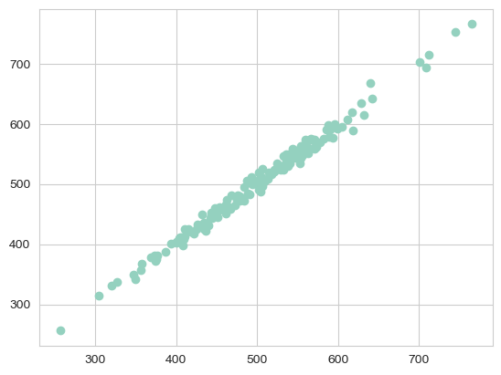
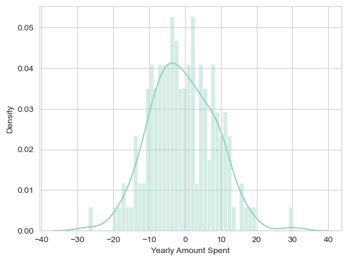
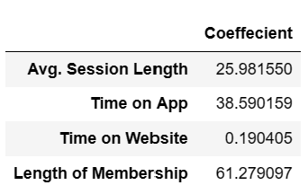

# Ecommerce Insights - Linear Regression

## Project Overview
This project provides insights for a hypothetical Ecommerce company based in NYC that sells clothing online, but also has in-store style and clothing advice sessions. Customers come in to the store, have sessions/meetings with a personal stylist, then they can go home and order either on a mobile app or website for the clothes they want. 

**The primary objective is to determine whether the company should focus their efforts on upgrading their mobile app experience or their website.** 

## Libraries Used
numpy, pandas, matplotlib, seaborn, sklearn

## Exploratory Data Analysis
### Plotting Time on Website and Time on App to Yearly Amount Spent:
Since we are trying to determine whether to focus efforts on their mobile or website experience, I plotted "Time on App" and "Time on Website" vs. "Yearly Amount Spent" in order to visualize the correlations. From these two graphs, I can see that Time on App has a higher correlation to Yearly Amount Spent compared to Time on Website.
 

### Plotting ALL Relationships:
I wanted to get a snapshot of all the relationships in the entire dataset, so I created a pairplot on the entire dataset. Based off this plot, **the most correlated feature with Yearly Amount Spent is Length of Membership.**

I created a linear model plot of the Yearly Amount Spent vs. Length of Membership

## Linear Regression Model and Predictions
I created testing and training data, with the x-values being "Avg. Session Length", "Time on App", "Time on Website", and "Length of Membership", and the y-value being "Yearly Amount Spent". I then fit my linear regression model to the training data.

## Evaluation of Model Predictions

The model predicted what the Y values would be for the the test data. I plotted out the Predicted Values and the Actual Values on a scatter plot and from this visualization, it seems that the model did pretty well. For context, a perfectly diagonal line would indicate a perfect model on the test data. 

For the mathematical evaluation of the model:

Root Mean Squared Error: 8.934

Mean Absolute Error: 7.228

Variance Score = 0.989

The model had a ~9% RMSE and ~99% of the variance is explained by my model, which means that it's a very good fit. This is also supported by the residuals visulization below: 

## Conclusion and Findings

So, should the company focus their efforts on website development or their mobile app? To answer this question in an effective way, I found the coefficients of my model:

To interpret the coefficients, for all other features fixed:
-a 1 unit increase in **Avg. Session Length** is associated with an **increase of 25.98 total dollars spent**.

-a 1 unit increase in **Time on App** is associated with an **increase of 38.59 total dollars spent**.

-a 1 unit increase in **Time on Website** is associated with an **increase of 0.19 total dollars spent**.

-a 1 unit increase in **Length of Membership** is associated with an **increase of 61.27 total dollars spent**.

Based on this, the company should **focus their efforts on their mobile app** because it's highly correlated with the amount of money that the customers spend.

